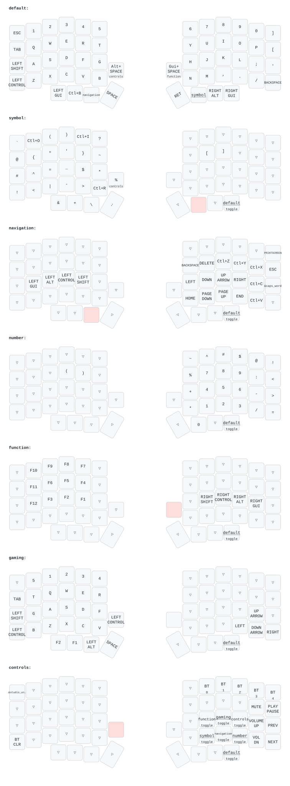

# Lily58 — раскладка ZMK

Прошивка для сплит-клавиатуры Lily58 на контроллерах nice!nano v2. Собирается GitHub Actions на каждый пуш, схема ниже перерисовывается автоматически из `config/lily58.keymap` — расходиться с кодом она не может.



## Слои

| № | слой | чем вызывается |
|---|---|---|
0 | default | — |
1 | symbol | правый большой, 2-я клавиша (удержание) |
2 | navigation | левый большой, 2-я клавиша (удержание) |
3 | number | `&to 3` из controls; выход — крайний правый большой |
4 | function | правая внутренняя клавиша нижнего ряда; тап — Super+Space (смена раскладки) |
5 | gaming | `&to 5` из controls; выход — крайний правый большой |
6 | controls | левая внутренняя клавиша нижнего ряда; тап — Alt+Space (rofi) |
7 | right-controls | правый большой, 3-я клавиша — sticky-моды правой руки |
8 | left-controls | левый большой, 3-я клавиша — sticky-моды левой руки |

Модификаторы вынесены на отдельные слои вместо hold-tap на домашнем ряду: так они не срабатывают ложно при быстрой печати. Внутри слоёв 7 и 8 они sticky — мод можно ткнуть и отпустить, он дождётся следующей клавиши; удержание тоже работает по-старому.

Слой `symbol` адаптирован под vim: `:` на позиции пробела, движения `^ $ * #` в домашнем ряду, парные символы в зеркальных колонках, `C-o`/`C-i` для прыжков по jumplist.

## Правка раскладки

Правится `config/lily58.keymap` — руками или через [keymap-editor](https://nickcoutsos.github.io/keymap-editor/). После пуша Actions соберут прошивку и перерисуют схему.

Клавиши базового слоя несут два значения: латинское и кириллическое, потому что `&kp` шлёт скан-код, а раскладку выбирает ОС. Перед перестановкой клавишу надо проверить по ЙЦУКЕН: `[` это `х`, `]` — `ъ`, `;` — `ж`, `'` — `э`, `,` — `б`, `.` — `ю`, `/` — точка.

## Сборка и прошивка из Linux

```bash
gh run watch                      # дождаться сборки
gh run download --name firmware -D /tmp/fw
```

Двойное нажатие RESET на плате поднимает UF2-загрузчик: устройство появляется целиком, без таблицы разделов, с меткой `NICENANO`.

```bash
lsblk -o NAME,LABEL | grep NICENANO
udisksctl mount -b /dev/sdX
cp /tmp/fw/firmware/lily58_left-*.uf2 /run/media/$USER/NICENANO/
```

Плата перезагружается сама, накопитель пропадает из `lsblk` — это и есть признак успеха; `cp` при этом может вернуть ошибку ввода-вывода.

Keymap обрабатывает только левая половина, она центральная. Правую достаточно прошивать при обновлении самой ZMK, изменении `lily58.conf` или после сброса настроек.

## ZMK Studio

Раскладку можно менять на лету через [zmk.studio](https://zmk.studio) — разблокировка на слое controls (левая внутренняя клавиша нижнего ряда + Esc).

Важно: сохранённый Studio keymap живёт в памяти устройства и **перекрывает прошитый**. Если после прошивки раскладка не изменилась — залить `settings_reset.uf2` в обе половины и прошить заново. Изменения, сделанные в Studio, в репозиторий не попадают — переносить их в `lily58.keymap` руками.

## Версия ZMK

`config/west.yml` запинен на конкретную ревизию, чтобы сборка была воспроизводимой. Обновление:

```bash
gh api repos/zmkfirmware/zmk/commits/main --jq .sha
```

Новый SHA вписать в `revision:` и прошить обе половины — при расхождении версий у половин может разойтись split-протокол.
